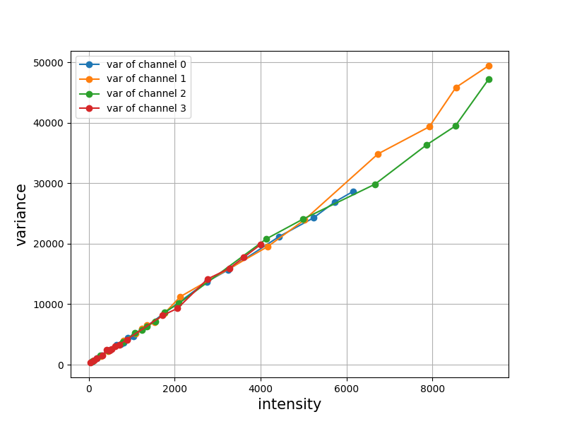
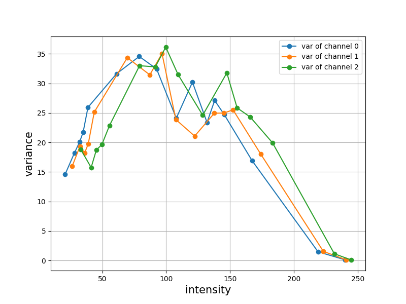
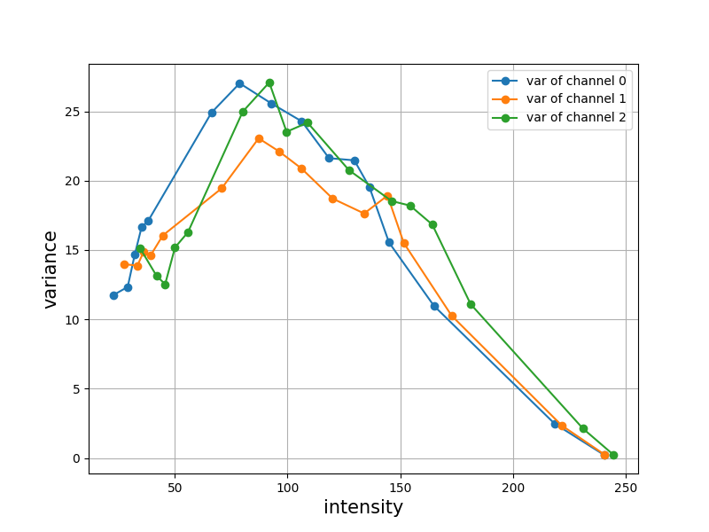
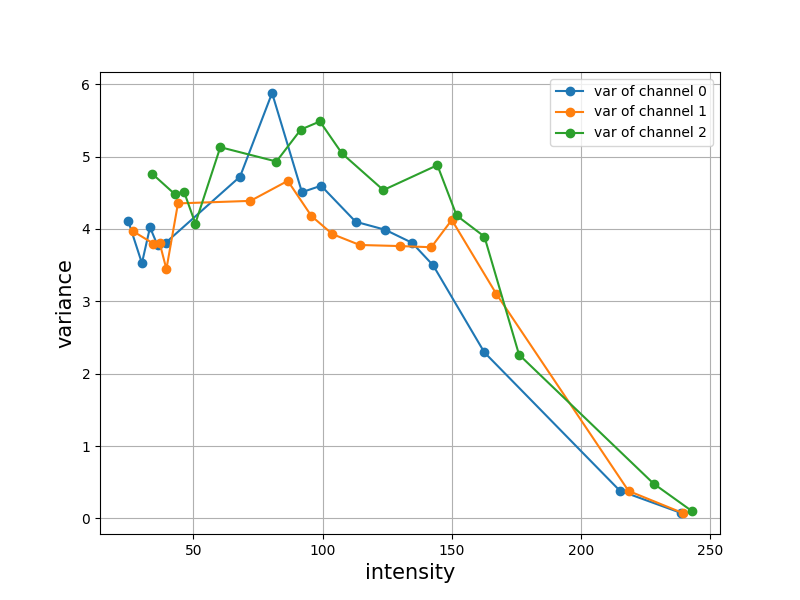
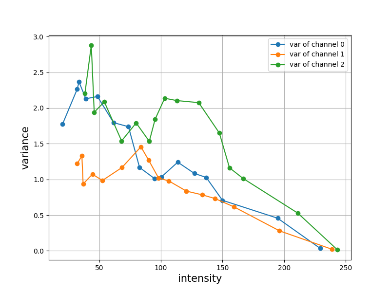

# Video Signal-Dependent Noise Estimation via Inter-frame Prediction

This repo is the official implementation of
the ICIP paper
"Video Signal-Dependent Video Noise Estimation via Inter-frame Prediction"
and the IPOL paper "A signal-dependent video noise estimator via inter-frame signal suppression".

## Abstract

We propose a block-based signal-dependent noise estimation method on videos, that leverages inter-frame redundancy to separate noise from signal. Block matching is applied to find block pairs between two consecutive frames with similar signal. Then Ponomarenko’s method is extended by sorting pairs by their low-frequency energy and estimating noise in the high frequencies. Experiments on three datasets show that this method improves on the state of the art.


## About the code

The code is written in python with a part of cython code for acceleration.
The program has been tested both on Linux and MacOS in python3.8, and should also work for other versions of python3.


Online demo is available on [IPOL](https://ipolcore.ipol.im/demo/clientApp/demo.html?id=420).

Version 1.2.1 released on 11/29/2023.

Contact: Yanhao Li ( yanhao {dot} li {at} outlook {dot} com )


## Install


``` bash
# configure python environment
conda create --name neif python=3.8
conda activate neif
pip install -r requirements.txt

# compile cython code
python setup.py build_ext -i
```

## Native noise estimator for two raw images

The native noise estimator only works on two consecutive raw images. Only the `.tif`, `.tiff` and `.dng` images are supported as input.  If the input raw images are in gray scale, use flag `-g` so that demosaicing is not processed, otherwise the raw images are demosaiced into 4-channel images and result in 4 noise curves.

You can set up the number of bins, quantile of the block pairs, search radius of block matching, block size, frequency separator and thickness of the surrounding ring of block for matching. You can also add additional noise to the input images with noise model $variance = a + b \times intensity$. Usage:

``` bash
usage: main.py [-h] [-bins BINS] [-q Q] [-s S] [-w W] [-T T] [-th TH] [-g] [-add_noise] [-noise_a NOISE_A] [-noise_b NOISE_B] im_0 im_1

Video Signal-Dependent Noise Estimation via Inter-frame Prediction. (c) 2022 Yanhao Li. Under license GNU AGPL.

positional arguments:
  im_0              First frame filename
  im_1              Second frame filename

optional arguments:
  -h, --help        show this help message and exit
  -bins BINS        Number of bins (default: 16)
  -q Q              Quantile of block pairs (default: 0.05)
  -s S              Search radius of patch matching (default: 5)
  -w W              Block size (default: 8)
  -T T              Frequency separator (default: w+1)
  -th TH            Thickness of ring for patch matching (default: 3)
  -g                Whether the input images are in grayscale (default: False)
  -add_noise        True for adding simulated noise, with noise model: variance = a + intensity * b. (default: False)
  -noise_a NOISE_A  Noise model parameter: a (default: 0.2)
  -noise_b NOISE_B  Noise model parameter: b (default: 0.2)
```


For instance, estimate noise curves from two successive raw frames:

``` bash
$ python main.py frame0.tiff frame1.tiff
```
The noise curves are saved to `curve_s0.txt` with B rows and 2C columns, where the first C columns store the intensities of C channels and the last C columns store the noise variances, and each row is for one bin. The curves are also plotted in `curve_s0.png`:



Or estimate noise curves with 24 bins, 5% of block pairs, block size at 9, thickness of ring at 4:

``` bash
$ python main.py -bins 24 -q 0.05 -w 9 -th 4 frame0.tiff frame1.tiff 
```


## Extended noise estimator

The extension of the noise estimator that incorporates both subpixel matching and multiscale noise estimation is available in `main_v2.py`. Either raw images in `.tif`, `.tiff` and `.dng` formats or processed images in `.jpg` and `.png` formats are supported. If the input images are raw images, the noise will be estimated only at the original scale. If the input images are processed images, the noise estimation will be processed at 4 scales. The parameter setting is similar as above. Usage:

``` shell
$ python main_v2.py -h

usage: main_v2.py [-h] [-bins BINS] [-q Q] [-s S] [-w W] [-T T] [-th TH] [-g] [-add_noise] [-noise_a NOISE_A] [-noise_b NOISE_B] [-f_us F_US]
                  im_0 im_1

Video Signal-Dependent Noise Estimation via Inter-frame Prediction. (c) 2022 Yanhao Li. Under license GNU AGPL.

positional arguments:
  im_0              First frame filename
  im_1              Second frame filename

optional arguments:
  -h, --help        show this help message and exit
  -bins BINS        Number of bins (default: 16)
  -q Q              Quantile of block pairs (default: 0.01)
  -s S              Search radius of patch matching (default: 5)
  -w W              Block size (default: 8)
  -T T              Frequency separator (default: 9)
  -th TH            Thickness of ring for patch matching (default: 3)
  -g                Whether the input images are in grayscale (default: False)
  -add_noise        True for adding simulated noise (default: False)
  -noise_a NOISE_A  Noise model parameter: a (default: 0.2)
  -noise_b NOISE_B  Noise model parameter: b (default: 0.2)
  -f_us F_US        Upsampling scale for subpixel matching (default: 0)
```


For instance, estimate noise curves from two successive processed images:

```shell
$ python main.py frame0.jpg frame1.jpg
```
The noise estimation will be processed at 4 scales. The noise curves at scale `?` are saved to `curve_s?.txt` with B rows and 2C columns, where the first C columns store the intensities of C channels and the last C columns store the noise variances, and each row is for one bin. 4 scales will be processed The curves are also plotted in `curve_s?.png`:

| scale 0 | scale 1 |   
|:--------------:|:-----------:|
|  |   | 
| scale 2 | scale 3 |
|  |  |

## Dataset

The noiseless synthetic drone videos mentioned in the paper are now available in [drive](https://drive.google.com/file/d/1LSq6DHv7xeErqm2thi2paJXNXlCVRRpd/view?usp=sharing). The dataset contains 16 sequences. Each sequence has 20 consecutive frames in gray scale.


# Citation
If you use this code for your research, please cite our paper:
```
@inproceedings{li2022video,
  title={Video Signal-Dependent Noise Estimation via Inter-Frame Prediction},
  author={Li, Yanhao and Gardella, Marina and Bammey, Quentin and Nikoukhah, Tina and von Gioi, Rafael Grompone and Colom, Miguel and Morel, Jean-Michel},
  booktitle={2022 IEEE International Conference on Image Processing (ICIP)},
  pages={1406--1410},
  year={2022},
  organization={IEEE}
}

@article{li2023signal,
  title={A Signal-dependent Video Noise Estimator Via Inter-frame Signal Suppression},
  author={Li, Yanhao and Gardella, Marina and Bammey, Quentin and Nikoukhah, Tina and von Gioi, Rafael Grompone and Colom, Miguel and Morel, Jean-Michel},
  journal={Image Processing On Line},
  volume={13},
  pages={280--313},
  year={2023}
}
```
