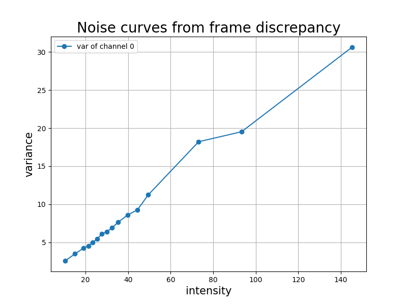

# Video Signal-Dependent Noise Estimation via Inter-Frame Prediction

This code is written in python with some cython code for acceleration.
The program is tested in python3.8, and should also work for other versions of python3.

## Install


``` bash
# configure python environment
conda create --name myenv python=3.8
conda activate myenv
pip install -r requirements.txt

# compile cython code
python setup.py build_ext -i
```

## Usage

``` python
from src.estimate import estimate_noise_curve

# img_0 and img_1 are 8-bit images

# using default parameters
intensities, variances = estimate_noise_curve(img_0, img_1)

# or using custom parameters
intensities, variances = estimate_noise_curve(img_0, img_1, w=..., T=..., th=..., q=..., bins=..., s=...)


```


## Demo

Estimate the noise curve from two successive frames:

frame t             |  frame t+1
:---:|:---:
  |  

``` bash
python main.py frame0.png frame1.png curve.png
```

The output is:
``` bash
Parameters:
Namespace(T=21, add_noise=False, bins=16, demosaic=False, im_0='frame0.png', im_1='frame1.png', noise_a=3, noise_b=3, out='curve.png', quantile=5, search_range=5, th=3, w=20)

###### Output ###### 

intensities:
[[ 10.48796082  15.10054016  18.94290733  21.35827637  23.31756401
   25.45682907  27.76812363  29.92989731  32.45368958  35.26985168
   39.89092255  44.3742218   49.48804855  73.16560364  93.31019592
  145.20797729]] 

noise variances:
[[ 2.56940198  3.4787209   4.21287107  4.53424597  4.98650312  5.40994263
   6.12378454  6.35898161  6.89056873  7.62035799  8.60838223  9.24898338
  11.23215771 18.21870422 19.52795792 30.63466454]] 

spent time: 7.277174472808838 s

```

The plotted noise curve:

<!--  -->


