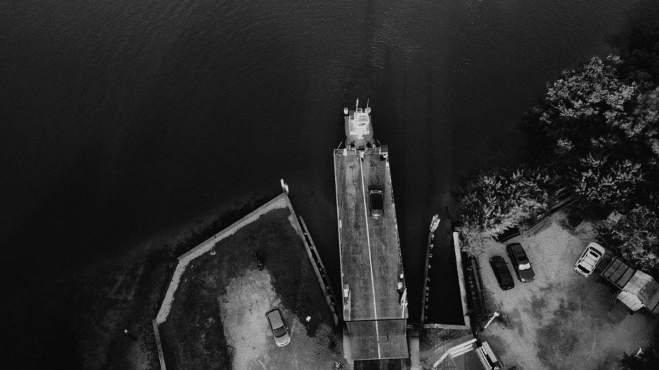
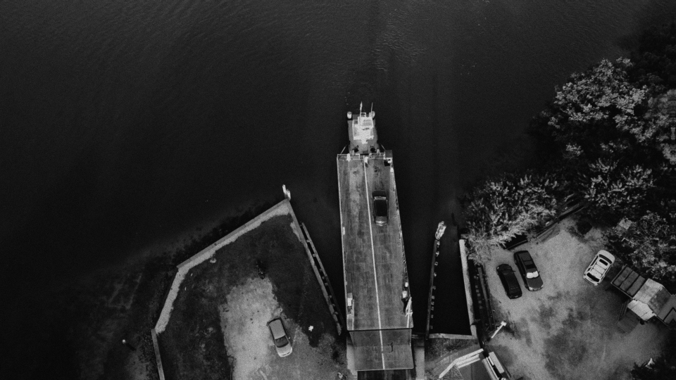
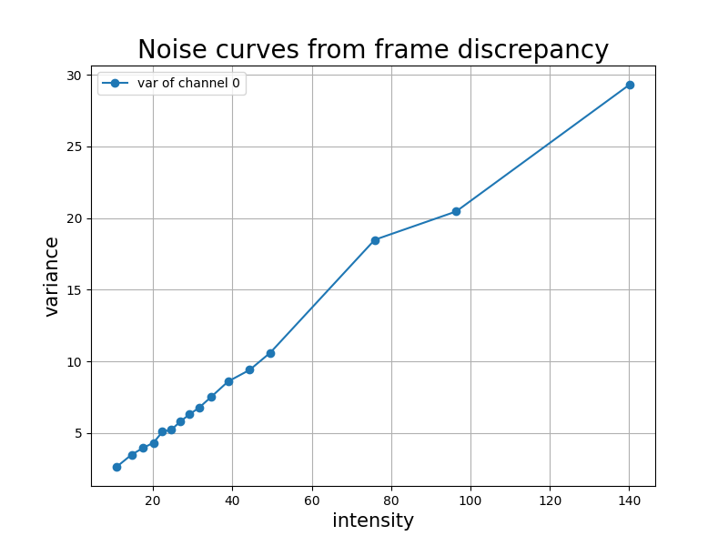

# Video Signal-Dependent Noise Estimation via Inter-frame Prediction

This repo is the official implementation of
the paper
"Video Signal-Dependent Video Noise Estimation via Inter-frame Prediction". 

## Abstract

We propose a block-based signal-dependent noise estimation method on videos, that leverages inter-frame redundancy to separate noise from signal. Block matching is applied to find block pairs between two consecutive frames with similar signal. Then Ponomarenko’s method is extended by sorting pairs by their low-frequency energy and estimating noise in the high frequencies. Experiments on three datasets show that this method improves on the state of the art.


## About the code

The code is written in python with a part of cython code for acceleration.
The program has been tested both on Linux and MacOS in python3.8, and should also work for other versions of python3.


Online demo is available on [IPOL](https://ipolcore.ipol.im/demo/clientApp/demo.html?id=77777000249).

Version 1.0 released on 12/09/2022.

Contact: Yanhao Li ( yanhao {dot} li {at} outlook {dot} com )


## Install


``` bash
# configure python environment
conda create --name myenv python=3.8
conda activate myenv
pip install -r requirements.txt

# compile cython code
python setup.py build_ext -i
```

## Usage

```
usage: main.py [-h] [-bins BINS] [-quantile QUANTILE] [-search_range SEARCH_RANGE] [-w W] [-T T] [-th TH] [-grayscale] [-add_noise] [-noise_a NOISE_A]
               [-noise_b NOISE_B] [-multiscale MULTISCALE] [-subpx_order SUBPX_ORDER]
               im_0 im_1

Video Signal-Dependent Noise Estimation via Inter-frame Prediction

positional arguments:
  im_0                  First frame filename
  im_1                  Second frame filename

optional arguments:
  -h, --help            show this help message and exit
  -bins BINS            Number of bins
  -quantile QUANTILE    Quantile of block pairs
  -search_range SEARCH_RANGE
                        Search range of patch matching
  -w W                  Block size
  -T T                  Frequency separator
  -th TH                Thickness of ring for patch matching
  -grayscale            Whether the input image is in grayscalenoise estimation
  -add_noise            True for adding simulated noise
  -noise_a NOISE_A      Noise model parameter: a
  -noise_b NOISE_B      Noise model parameter: b
  -multiscale MULTISCALE
                        Number of scales for downscaling. -1 for automatic selection of scales.
  -subpx_order SUBPX_ORDER
                        Upsampling scale for subpixel matching
```

Please use the command `python main.py -h` to see the detailed usage.

Estimate noise curve from two successive frames:

frame t             |  frame t+1
:---:|:---:
  |  

``` bash
python main.py frame0.png frame1.png
```

The output is:
``` bash
Parameters:
Namespace(T=-1, add_noise=False, bins=16, demosaic=False, im_0='frame0.png', im_1='frame1.png', multiscale=0, noise_a=3, noise_b=3, quantile=5, search_range=5, th=3, w=8)

###### Output ###### 
Parameters:
Namespace(T=-1, add_noise=False, bins=16, demosaic=False, im_0='frame0.png', im_1='frame1.png', multiscale=0, noise_a=3, noise_b=3, quantile=5, search_range=5, th=3, w=8)

###### Output ###### 

intensities:
[[ 10.87425613  14.6869421   17.64328384  20.18724823  22.4411869
   24.70471954  26.92080116  29.29936409  31.69148064  34.67023849
   38.94697571  44.32183456  49.53039932  75.42604065  96.12397766
  140.07905579]] 

noise variances:
[[ 2.75614262  3.46342993  4.06296873  4.23521328  4.80944681  5.42198753
   5.72610235  6.65154648  6.62480831  7.52370214  8.50011253  9.52011967
  10.69717789 18.39974976 20.59931374 29.30751991]] 

time spent: 2.338838815689087 s

```

The plotted noise curve:

<!--  -->





## Python API
``` python
from src.estimate import estimate_noise_curve

# using default parameters
intensities, variances = estimate_noise_curve(img_ref, img_mov)

# or using custom parameters (see the function description for the use of parameters)
intensities, variances = estimate_noise_curve(img_ref, img_mov, w=..., T=..., th=..., q=..., bins=..., s=..., f=...)

```

Parameters:

- `img_ref`: np.ndarray. Reference image of size (C, H, W)
  
- `img_mov`: np.ndarray. Moving image of size (C, H, W)
    
- `w`: int. Block size
    
- `T`: int. Threshold for separating the entries for low and high frequency DCT coefficents

- `th`: int. Thickness of surrounding ring for matching

- `q`: float. Percentile of blocks used for estimation

- `bins`: int. Number of bins

- `s`: int. Half of search range for patch matching. 
  Note that the range of a squared search region window = search_range * 2 + 1

- `f`: int. The scale factor if estimate noise at a higher scale. Basically the block pairs of size `f*w` are selected, then are downscaled at size `w`, and finally the noise variance is estimated from the high frequencies of the downscaled block pairs.


# Citation
If you use this code for your research, please cite our paper.
```
@inproceedings{li2022video,
  title={Video Signal-Dependent Noise Estimation via Inter-Frame Prediction},
  author={Li, Yanhao and Gardella, Marina and Bammey, Quentin and Nikoukhah, Tina and von Gioi, Rafael Grompone and Colom, Miguel and Morel, Jean-Michel},
  booktitle={2022 IEEE International Conference on Image Processing (ICIP)},
  pages={1406--1410},
  year={2022},
  organization={IEEE}
}
```
